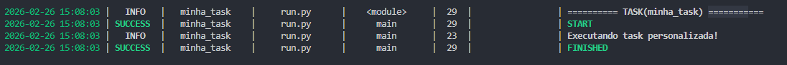
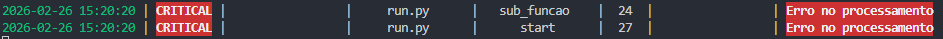
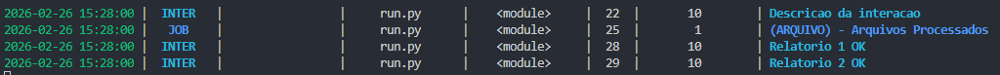

## BotUts

BotUts é uma biblioteca para automação de tarefas, monitoramento, integração com Portainer, Selenoid, e gerenciamento de bots. Ela oferece uma interface CLI e diversas funcionalidades para facilitar a operação de robôs e stacks.


---

### Instalação

Para instalar a biblioteca, basta executar:

```bash
pip install botUts
```

---

### Configuração


Você pode definir as variáveis de ambiente manualmente ou criar um arquivo `.env` na raiz do projeto com o seguinte formato:

**Obrigatórias:**

```ini
BOT_NAME           = MeuBot
BOT_ID             = 123
MODE               = DEV   #DEFAULT DEV (`DEV` ou `PRD`)
```
O arquivo `.env` será carregado automaticamente

Defina as variáveis de ambiente necessárias para o funcionamento do bot e integrações:


**Portainer:** `(Opcional fixo na maquina de DEV)`
```ini
PORTAINER_HOST     = <http://localhost:9000>
PORTAINER_USER     = <USER>
PORTAINER_PASSWORD = <PASWORD>
```

**Selenoid/Moon:**  `(Opcional fixo na maquina de DEV)`
```ini
MOON_HOST = <http://localhost:444/wd/hub>
```

---

### Funcionalidades Principais

#### CLI (Interface de Linha de Comando)
Execute comandos utilitários para setup, atualização, execução de tasks e integração com Portainer:

- `bot-help` — Mostra ajuda e comandos disponíveis
- `gitup <comment>` — Atualiza o repositório Git
- `upreq <atualiza a venv com os novos requirements>` — Atualiza os requirements da venv
- `setupy` — Cria venv, atualiza pip e instala requirements
- `bot-tasks` — Lista todas as tasks do bot
- `bot-run` — Executa a primeira task
- `bot-run <task>` — Executa uma task específica
- `bot-run-all` — Executa todas as tasks
- `bot-loop` — Inicia o loop do processo (verifica os schedulles) #Auto orquestraçao
- `bot-stack` — Cria stack no Portainer
- `bot-deploy` — Redeploy da stack no Portainer
- `bot-run-prd` — Executa o bot em produção

#### Portainer
Validação de credenciais, criação e redeploy de stacks, integração com ambiente Portainer.

#### Selenoid/Moon
Listagem, remoção e gerenciamento de sessões de automação.

#### Tasks
Definição e execução de tarefas agendadas ou locais, com suporte a CRON.

#### Marcação e Monitoramento
Marcação de eventos/interações e monitoramento de APIs, com registro de logs e métricas.


#### Logs Organizados
O sistema de logs do BotUts é altamente organizado e flexível, permitindo:
- Armazenamento de logs em arquivos diários, terminal e banco de dados.
- Formatação avançada das mensagens, incluindo informações de função, arquivo, linha e extras.
- Detecção automática de warnings e erros.
- Integração com monitoramento de tarefas e eventos.

**Vantagens:**
- Facilita auditoria e rastreamento de execuções.
- Permite análise detalhada de falhas e performance.
- Logs podem ser visualizados no terminal, arquivos ou banco, conforme necessidade.
- Customização de níveis e formatos.

### Exemplo de Uso

#### Variaveis do projeto

```python
from bot_lib import botConfig

print(botConfig.BOT_NAME)
print(botConfig.BOT_ID)
print(botConfig.MODE)
print(botConfig.is_in_prd)

```

```
<BOT_NAME>
R001
DEV
False
```

#### Criando uma Task

```python
from bot_lib import Task,logger

@Task.config(task_name="minha_task", local=True,comment="task de teste")  #local=True sao tasks que nao sao schedulladas e sao executadas sobre demanda
def main():
	logger.info("Executando task personalizada!")

@Task.config(task_name="minha_cron_task", cron="0 14 * * *")  #essa task ira executar automaticamente as 14:00 utilize o comando bot-loop
def main():
	logger.info("Executando task personalizada!")

```
- utilize `bot-tasks` para caso deseje listar as tasks
- para executar a primeira task definida `bot-run`
- para executar uma task especifica `bot-run minha-task`
- para executar as tasks em loop `bot-loop`



---

#### Retry
Permite repetir uma função automaticamente em caso de falha.

```python
from bot_lib import retry

@retry(attempts=3, delay=2)
def tarefa():
	print("Executando tarefa...")
	raise Exception("Falha!")

tarefa()  # Será executada até 3 vezes
```
---

#### Timeout
Permite limitar o tempo de execução de uma função:

```python
from bot_lib import timeout
import time

@timeout(time=5)
def tarefa_lenta():
	time.sleep(10)
	print("Finalizou!")

tarefa_lenta()  # Será interrompida após 5 segundos
```
---
#### logger_class
O Logger class faz o traking automatico dos seus metodos informando nos logs caso algum erro ocorra.

```python
from bot_lib import logger_class

@logger_class
class Rpa:
    def sub_funcao(self):
        raise Exception("Erro no processamento")

    def start(self):
        self.sub_funcao()


Rpa().start()

```


#### Marcação (marks)
Permite registrar eventos, interações e jobs para rastreamento e auditoria.

- INTERACAO -> sao pequenos ganhos de tempo
- JOB       -> tarefas completas concluidas

```python
from bot_lib import mark_inter, commit_mark_inter, mark_job

# Marca uma interação de 10 segundos (commita diretamente no banco caso em producao)
mark_inter(10,"Descricao da interacao")

# Marca 1 arquivo processado para contabilizar
mark_job("ARQUIVO","Arquivos Processados",qtd=1)

#EXEMPLO COM COMMIT ATRASADO
mark_inter(10,"Relatorio 1 OK",commit=False)
mark_inter(10,"Relatorio 2 OK",commit=False)

# Commita todas as marcações pendentes
commit_mark_inter()

```


### Observações
- Consulte o código dos módulos para detalhes avançados.
- As funcionalidades são acessíveis via CLI ou importando os módulos Python.
- Para integração com Portainer e Selenoid, configure as variáveis de ambiente corretamente.

---

### Licença
Este projeto é distribuído sob a licença MIT.
